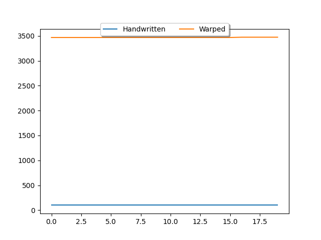
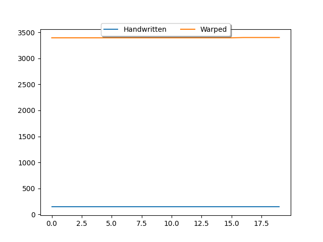
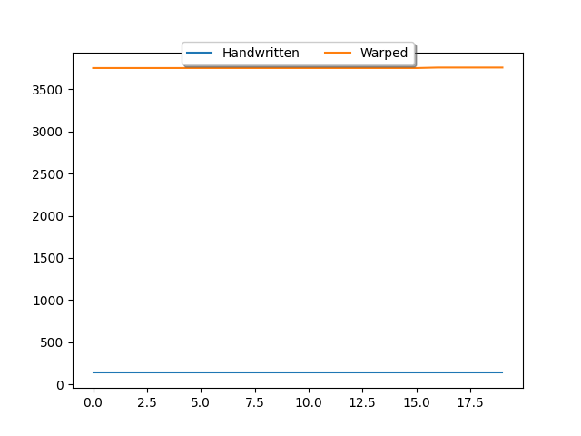
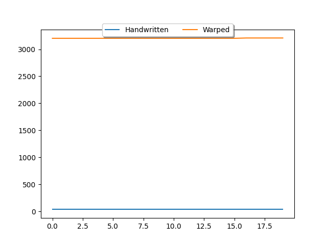
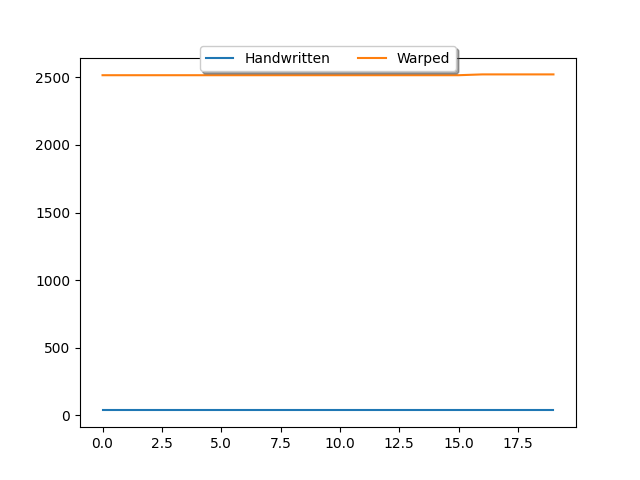
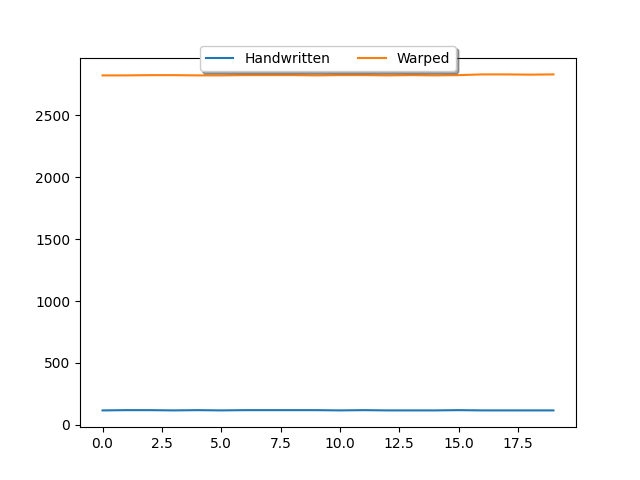
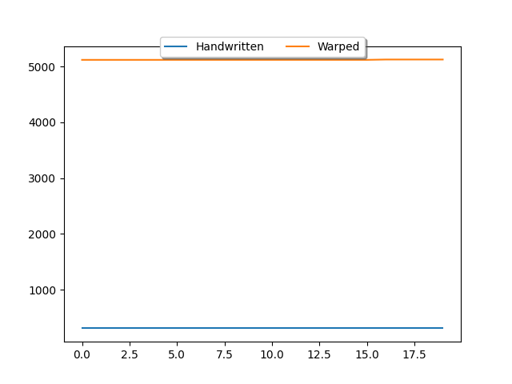
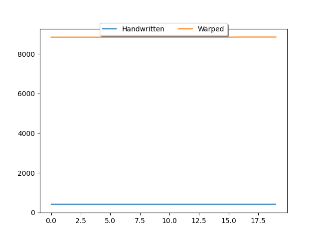
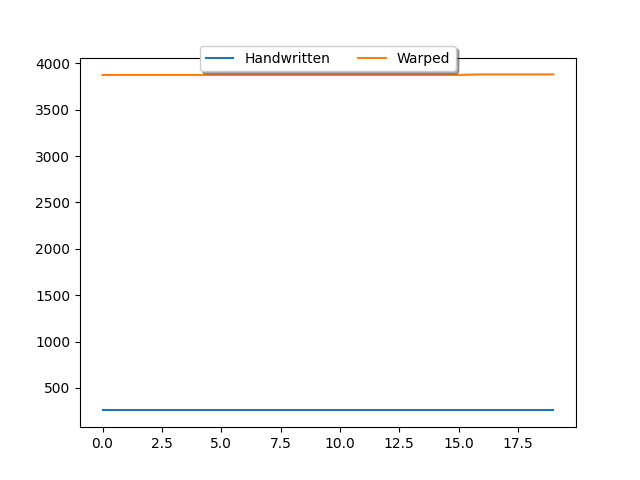
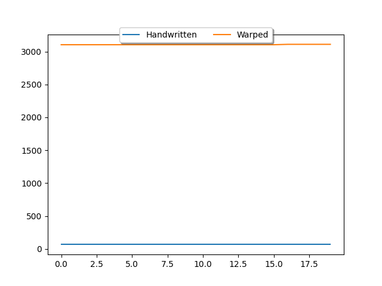

# Warp Benchmark
 Tracking the progress of Warp, the Solidity to Cairo compiler.
## WETH10
### Steps in approve

### Steps in deposit

### Steps in depositTo

### Steps in flashFee

### Steps in maxFlashLoan

### Steps in totalSupply

### Steps in transfer

### Steps in transferFrom

## BaseJumpRateModelV2
### Steps in getSupplyRate

### Steps in updateJumpRateModel

### Steps in utilizationRate

